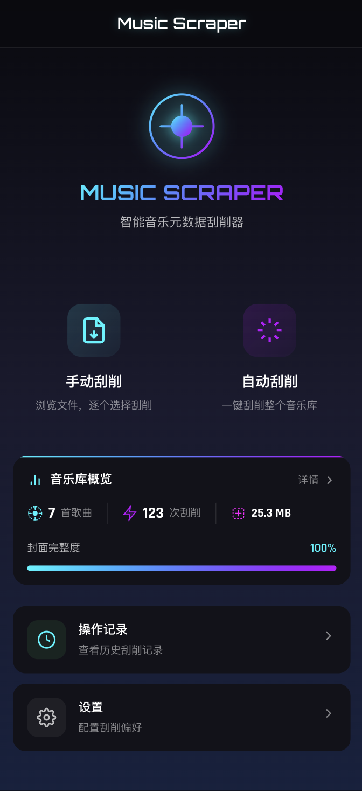
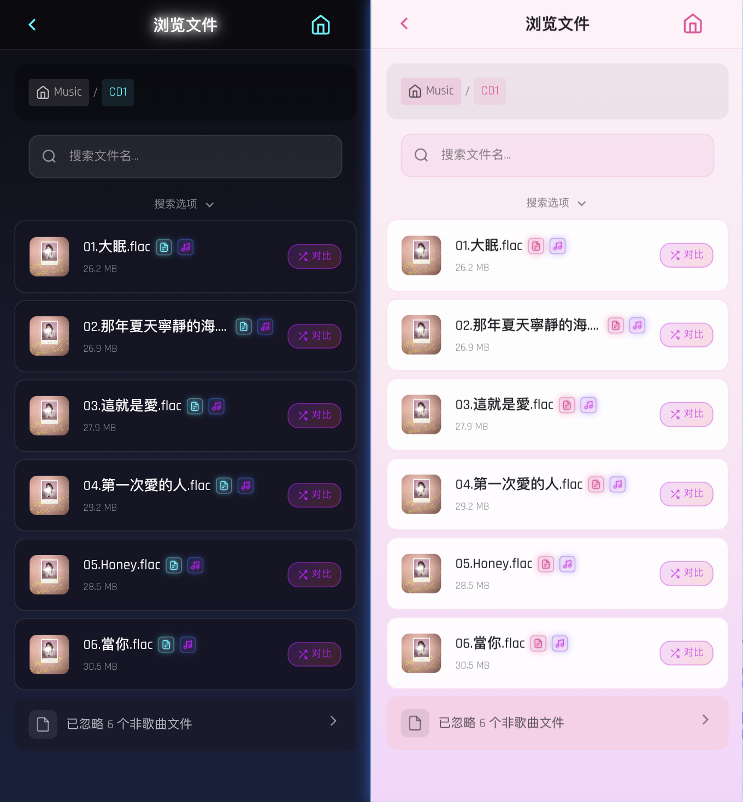
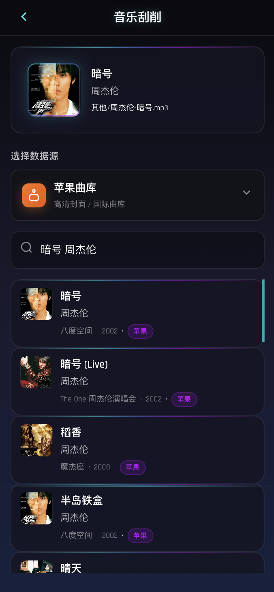
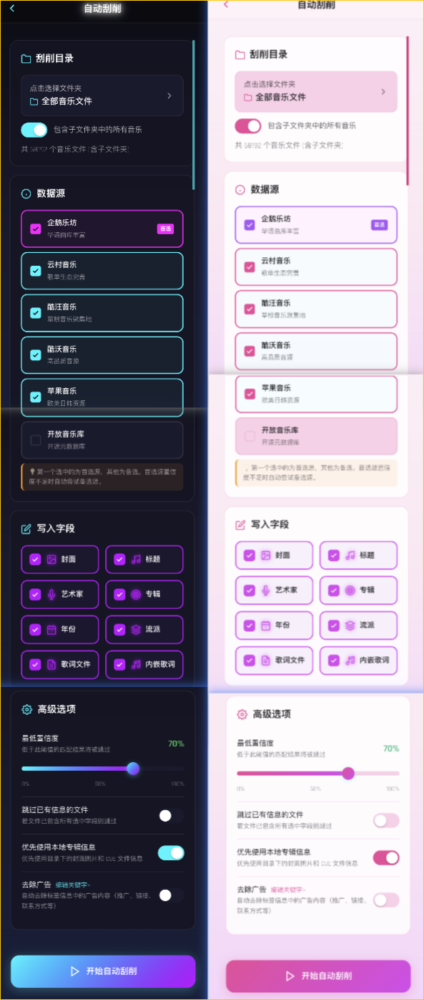
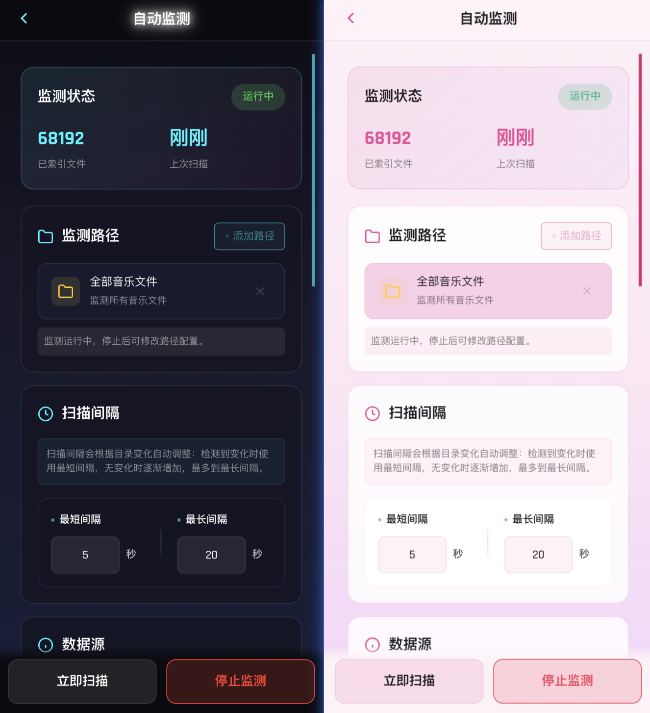
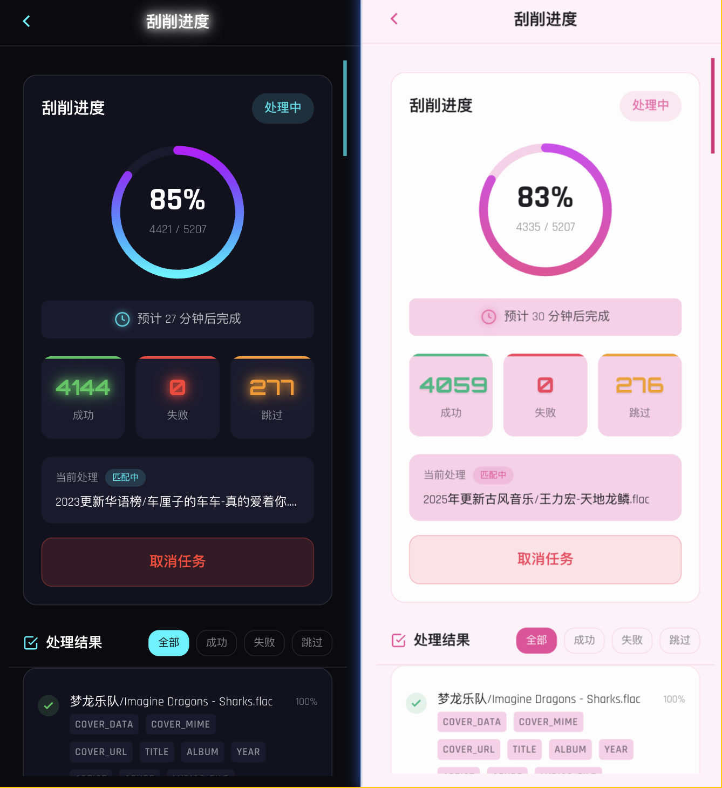

<p align="center">
  
</p>

<h1 align="center">🎵 Music Scraper</h1>

<p align="center">
  <strong>专为 NAS 用户打造的音乐元数据刮削工具</strong>
</p>

<p align="center">
  <a href="#-功能特性">功能特性</a> •
  <a href="#-界面预览">界面预览</a> •
  <a href="#-快速部署">快速部署</a> •
  <a href="#-使用指南">使用指南</a> •
  <a href="#-常见问题">常见问题</a>
</p>

<p align="center">
  
  
  
  
</p>

---

## 📖 项目简介

**Music Scraper** 是一款轻量级的音乐元数据刮削工具，帮助你自动获取音乐文件的封面、歌词、艺术家等信息。专为 NAS（网络存储）用户设计，支持 Docker 一键部署，通过网页即可在手机/电脑上操作。

### 🎯 解决什么问题？

- 音乐文件没有封面，播放器显示空白？
- 歌曲信息不完整，无法按专辑/艺术家分类？
- 手动一首首填写信息太麻烦？

**Music Scraper 帮你自动完成这些工作！**

---

## ✨ 功能特性

| 功能 | 说明 |
|------|------|
| 🎯 **多数据源** | 支持企鹅、云村、酷系、苹果、开放库等 6 大音乐数据源 |
| 🖼️ **智能匹配** | 基于置信度算法自动选择最佳匹配结果 |
| 📱 **移动端适配** | 赛博朋克风格 UI，支持手机/平板访问 |
| 🚀 **一键部署** | Docker 镜像开箱即用，专为 NAS 优化 |
| 📦 **批量处理** | 支持整个文件夹自动批量刮削 |
| 🎵 **多格式支持** | MP3、FLAC、M4A、OGG、WAV、WMA、DSF、DFF 等 |
| 📝 **歌词获取** | 自动下载歌词并保存为 LRC 文件 |
| 🎤 **内嵌歌词** | 支持将歌词直接写入音频文件元数据，独立歌词编辑页面 |
| 🔄 **多源互补** | 首选源缺少数据时，自动从其他源补充 |
| 🛡️ **广告过滤** | 自动识别并清理音乐标签中的广告内容，保持元数据干净整洁 |
| ⚡ **熔断保护** | 数据源连续失败后自动熔断，避免无效请求，提升稳定性 |
| 🎨 **双主题支持** | 暗夜/樱两种主题风格，支持一键切换 |
| ✏️ **手动编辑** | 独立编辑页面，支持元数据修改和封面上传 |
| 🎤 **双语歌词** | 自动合并原文和翻译歌词 |
| 🔐 **登录认证** | 密码保护 + 两步验证（2FA），保护您的音乐库安全 |
| 🧰 **工具箱集成** | 内置工具箱前端，硬链接整理、自动分类、刮削后自动联动（v2.0.0 新增） |
| 🎧 **Hi-Res 支持** | DSF/DFF/DTS 高解析度音频格式支持（v2.0.0 新增） |
| 🔍 **搜索增强** | 文件浏览器支持按标题/艺术家/专辑字段筛选搜索（v2.0.0 新增） |
| ⚡ **高性能架构** | Go 语言重构，原生并发，性能大幅提升（v2.0.0 新增） |
| ⚙️ **并发可配置** | 刮削并发数用户可配置（1-16）（v2.0.0 新增） |

---

## 🎨 界面预览

### 首页

赛博朋克风格设计，深邃暗色背景配合霓虹色彩。

<p align="center">
  
</p>

### 文件浏览

支持目录导航，快速定位音乐文件。

<p align="center">
  
</p>

### 手动刮削

选择数据源，搜索并匹配歌曲信息。

<p align="center">
  
</p>

### 自动刮削

一键批量处理，智能匹配最佳结果。

<p align="center">
  
</p>

### 自动监测

定时扫描音乐目录，自动检测新增/修改的文件并触发刮削。

<p align="center">
  
</p>

### 刮削进度

实时查看批量刮削进度，支持查看成功/失败/跳过的文件详情。

<p align="center">
  
</p>

### 音乐库统计

可视化展示音乐库元数据完整度。

<p align="center">
  
</p>

---

## 🚀 快速部署

### 方式一：Docker Hub 拉取（最简单）

如果你的 NAS 或服务器可以联网访问 Docker Hub，直接拉取即可：

```bash
# x86 架构（绿联云、威联通、部分群晖）
docker pull minzgo/music-scraper:2.0.0-amd64

# ARM 架构（部分群晖、树莓派）
docker pull minzgo/music-scraper:2.0.0-arm64

# 运行容器
docker run -d \
  --name music-scraper \
  -p 7301:7301 \
  -v /你的音乐目录:/app/music \
  -v /持久化目录:/app/data \
  -e TZ=Asia/Shanghai \
  --restart unless-stopped \
  minzgo/music-scraper:2.0.0-amd64
```

> 💡 **Docker Hub 地址**：https://hub.docker.com/r/minzgo/music-scraper

---

### 方式二：NAS 导入镜像（离线部署）

适用于无法联网或网络较慢的 NAS 设备。

适用于所有支持 Docker 的 NAS 设备（绿联云、群晖、威联通等）。

**第一步：下载镜像文件**

从 [Releases](https://github.com/SimonLYU/MusicScraper/releases) 页面下载：
- `music-scraper-2.0.0-amd64.tar`（x86 架构，适用于绿联、威联通、部分群晖）
- `music-scraper-2.0.0-arm64.tar`（ARM 架构，适用于部分群晖）

> 不确定架构？绿联云 NAS DXP 系列通常是 x86（amd64），选择 amd64 版本即可；DH 系列通常是 arm 架构，选择 arm64 版本即可。

**第二步：上传并导入镜像**

1. 将 `.tar` 文件上传到 NAS（绿联云需存放在共享文件夹中）
2. 打开 NAS 的 Docker 管理界面
3. 选择「**导入镜像**」或「**本地导入**」
4. 选择上传的 `.tar` 文件，等待导入完成

**第三步：创建容器**

在 Docker 管理界面创建容器，配置如下：

| 配置项 | 值 | 说明 |
|--------|-----|------|
| 镜像 | `music-scraper:2.0.0-amd64` | 选择刚导入的镜像 |
| 容器名称 | `music-scraper` | 自定义名称 |
| 端口映射 | `7301` → `7301` | 本地端口 → 容器端口 |
| 文件夹挂载 | `/你的音乐目录` → `/app/music` | 挂载你的音乐文件夹 |
| 文件夹挂载 | `/持久化目录` → `/app/data` | 保存刮削数据和配置 |
| 环境变量 | `TZ=Asia/Shanghai` | 设置时区（可选） |

**第四步：访问使用**

打开浏览器访问 `http://NAS的IP:7301` 即可使用！

---

### 方式三：Docker Compose 项目（进阶）

适用于绿联云「项目」功能或群晖 SSH 命令行，配置更灵活。

> 💡 **绿联云用户注意**：使用此方式可以突破图形界面「只能选择共享文件夹」的限制，直接在配置中指定任意路径（如 `/home/用户名/Music`），无需将音乐文件移动到共享文件夹。

> ⚠️ 前提：需要先完成方式二的「导入镜像」步骤，或使用方式一从 Docker Hub 拉取镜像！

**创建 Compose 配置**

在绿联云中创建新项目，或在群晖中创建 `docker-compose.yml` 文件：

**基础配置（仅刮削器）：**
```yaml
version: '3'
services:
  music-scraper:
    image: music-scraper:2.0.0-amd64
    pull_policy: never          # 重要！使用本地镜像，不从远程拉取
    container_name: music-scraper
    ports:
      - "7301:7301"
    volumes:
      - /你的音乐目录:/app/music    # 修改为你的音乐文件夹路径
      - ./data:/app/data            # 数据持久化
    environment:
      - TZ=Asia/Shanghai
    restart: unless-stopped
```

**完整配置（刮削器 + 工具箱）：**
```yaml
version: '3'
services:
  # 刮削器主服务
  music-scraper:
    image: music-scraper:2.0.0-amd64
    pull_policy: never
    container_name: music-scraper
    privileged: true
    ports:
      - "7301:7301"
    volumes:
      # Docker socket（用于“工具箱与刮削器的监控关联逻辑”，自动获取挂载映射，实现路径自动转换）
      - /var/run/docker.sock:/var/run/docker.sock:ro
      # 将下文中“/你的音乐目录”改为你真实存放音乐的路径，注“:/app/music”部分保留勿动。
      - /你的音乐目录:/app/music
      - ./scraper-data:/app/data
    environment:
      - TZ=Asia/Shanghai
      - TOOLBOX_URL=http://music-toolbox:7305  # 工具箱地址
    restart: unless-stopped
    depends_on:
      - music-toolbox

  # 工具箱服务（硬链接整理）
  music-toolbox:
    image: music-toolbox:2.0.0-amd64
    pull_policy: never
    container_name: music-toolbox
    ports:
      - "7305:7305"
    volumes:
      # Docker socket（用于"工具箱与刮削器的监控关联逻辑"，自动获取挂载映射，实现路径自动转换）
      - /var/run/docker.sock:/var/run/docker.sock:ro
      # 挂载音乐目录的父目录，确保硬链接正常工作
      # 例如：音乐在 /volume2/音乐，输出到 /volume2/整理后，则挂载 /volume2
      - /你的存储卷:/app/source:rw
      - ./toolbox-data:/app/data
    environment:
      - TZ=Asia/Shanghai
      - SCRAPER_URL=http://music-scraper:7301  # 刮削器地址（用于授权验证）
    restart: unless-stopped
```

**配置说明**

| 配置项 | 说明 |
|--------|------|
| `image` | 必须与导入的镜像名称一致 |
| `pull_policy: never` | 关键配置！禁止从远程拉取，只使用本地镜像 |
| `volumes` | 刮削器挂载音乐目录，工具箱挂载父目录（确保硬链接正常） |
| `TOOLBOX_URL` | 刮削器连接工具箱的地址，**必须使用 Docker 服务名**如 `http://music-toolbox:7305` |
| `/var/run/docker.sock` | Docker socket，用于自动获取挂载映射，实现刮削器和工具箱间的路径自动转换 |

> 💡 **硬链接要求**：工具箱的源目录和输出目录必须在同一挂载点（`/app/source`）下，否则会自动降级为复制。
>
> ⚠️ **联动配置关键点**：
> - `TOOLBOX_URL`：刮削器连接工具箱的地址，使用 Docker 服务名 `http://music-toolbox:7305`，不能使用 `localhost`
> - `SCRAPER_URL`：工具箱连接刮削器的地址，使用 Docker 服务名 `http://music-scraper:7301`（用于授权验证）
> - **Docker socket 挂载**：两个服务都需要挂载 `/var/run/docker.sock`，用于自动获取挂载映射
> - **工具箱挂载**：挂载音乐目录的**父目录**到 `/app/source`，例如音乐在 `/volume2/音乐`，则挂载 `/volume2:/app/source`

**运行项目**

- **绿联云**：在项目界面点击「启动」
- **群晖 SSH**：`docker-compose up -d`

---

### 方式四：Docker 命令行（高级）

适用于有 SSH 访问权限的用户或 Linux 服务器。

```bash
# 1. 先导入镜像（假设 tar 文件在当前目录）
docker load -i music-scraper-2.0.0-amd64.tar

# 2. 运行容器
docker run -d \
  --name music-scraper \
  -p 7301:7301 \
  -v /你的音乐目录:/app/music \
  -v /持久化目录:/app/data \
  -e TZ=Asia/Shanghai \
  --restart unless-stopped \
  music-scraper:2.0.0-amd64
```

访问 `http://你的IP:7301` 即可使用。

---

## 📖 使用指南

### 1️⃣ 浏览音乐文件

<!-- 📸 截图位置：文件浏览操作截图 -->
<!-- 建议截图：点击目录进入子文件夹的操作 -->

1. 打开首页，点击 **"浏览文件"** 卡片
2. 导航到包含音乐文件的目录
3. 点击音乐文件可查看当前元数据

### 2️⃣ 手动刮削单首歌曲

<!-- 📸 截图位置：手动刮削操作流程截图 -->
<!-- 建议截图：选择歌曲 → 搜索 → 选择匹配项 → 确认写入 的完整流程 -->

1. 在文件浏览中选择一首歌曲
2. 点击 **"刮削"** 按钮
3. 选择数据源（华语歌曲推荐企鹅或云村）
4. 从搜索结果中选择正确的匹配项
5. 勾选要写入的字段（封面、标题、艺术家等）
6. 点击 **"确认写入"**

### 3️⃣ 自动批量刮削

<!-- 📸 截图位置：自动刮削配置截图 -->
<!-- 建议截图：展示数据源选择、字段选择、置信度设置等配置项 -->

1. 打开首页，点击 **"自动刮削"** 卡片
2. 选择要刮削的目录
3. 配置刮削选项：
   - **数据源**：勾选要使用的数据源（支持多选，会自动互补）
   - **字段**：选择要获取的信息（封面、歌词、标题等）
   - **最低置信度**：设置匹配阈值（建议 70%）
   - **跳过已有**：是否跳过已有封面/歌词的文件
4. 点击 **"开始刮削"**

### 4️⃣ 查看刮削历史

<!-- 📸 截图位置：历史记录页截图 -->
<!-- 建议截图：展示刮削历史列表和任务详情 -->

1. 打开首页，点击 **"刮削记录"** 卡片
2. 查看历史刮削任务和结果
3. 可以查看每首歌的刮削详情

### 5️⃣ 查看音乐库统计

1. 打开首页，点击 **"音乐库概览"** 卡片
2. 查看元数据完整度、格式分布、刮削覆盖率等统计信息

### 6️⃣ 使用工具箱（硬链接整理）

> 💡 需要部署工具箱服务，参见「方式三：Docker Compose 项目」的完整配置

1. 打开首页，点击 **"工具箱"** 卡片进入工具箱
2. 点击 **"硬链接整理"** 进入整理功能
3. 首次使用需要配置：
   - **源目录**：选择音乐文件所在目录（在 `/app/source` 下选择）
   - **目标目录**：选择硬链接输出目录（在 `/app/source` 下选择，需与源目录同级或平级）
   - **分类模式**：歌手/专辑/流派/年份/平铺
   - **重命名格式**：保留原名/音轨号-标题/歌手-标题 等
   - **监控模式**：实时监控/定时轮询/刮削器联动（推荐刮削器联动）
4. 可选功能：
   - **批量整理**：一次性处理所有文件
   - **自动监控**：开启后刮削完成自动触发整理

**监控模式说明**：
- **实时监控**：监控文件系统事件，新文件立即整理
- **定时轮询**：每隔 N 分钟扫描一次目录
- **刮削器联动**（推荐）：仅响应刮削器通知，确保文件元数据完整后再整理

**硬链接的优势**：
- 不占用额外磁盘空间
- 修改元数据会同步到所有硬链接
- 删除硬链接不影响原文件

---

## ⚙️ 配置说明

### 环境变量

| 变量 | 默认值 | 说明 | 适用服务 |
|------|--------|------|----------|
| `PORT` | `7301` | 服务端口 | 刮削器 |
| `MUSIC_DIR` | `/app/music` | 音乐文件目录 | 刮削器 |
| `DATA_DIR` | `/app/data` | 数据存储目录 | 刮削器/工具箱 |
| `TZ` | `UTC` | 时区设置 | 刮削器/工具箱 |
| `TOOLBOX_URL` | `http://localhost:7305` | 工具箱内部通信地址（后端间通信） | 刮削器 |
| `TOOLBOX_EXTERNAL_URL` | 自动推断 | 工具箱外部访问地址（浏览器跳转用，反向代理场景必填） | 刮削器 |
| `SCRAPER_URL` | 自动发现 | 刮削器地址（用于授权验证） | 工具箱 |
| `SCRAPE_WORKERS` | `8` | 刮削并发数（1-16，可在设置界面调整） | 刮削器 |

> 💡 **地址配置说明**：
> - `TOOLBOX_URL`：刮削器**后端**连接工具箱的地址，Docker 部署时**必须**使用服务名如 `http://music-toolbox:7305`（Docker 内网通信）
> - `TOOLBOX_EXTERNAL_URL`：用户**浏览器**跳转到工具箱的地址，反向代理场景需配置为外部可访问地址
> - `SCRAPER_URL`：工具箱**后端**连接刮削器的地址，Docker 部署时**必须**使用服务名如 `http://music-scraper:7301`（用于授权验证）
> - 如果未配置 `TOOLBOX_EXTERNAL_URL`，前端会自动使用 `当前页面主机名:7305` 作为跳转地址
>
> ⚠️ **常见错误**：`TOOLBOX_URL` 和 `SCRAPER_URL` 不能配置为 `localhost`，因为容器内的 localhost 指向容器自身！

### 数据卷说明

| 路径 | 说明 | 适用服务 |
|------|------|----------|
| `/app/music` | 音乐文件目录 | 刮削器 |
| `/app/data` | 数据存储目录（配置、数据库） | 刮削器/工具箱 |
| `/app/source` | 数据源根目录（包含音乐和输出目录） | 工具箱 |
| `/var/run/docker.sock` | Docker socket（路径自动转换） | 刮削器/工具箱（联合部署时） |

> 💡 **Docker socket 说明**：挂载 Docker socket 后，刮削器和工具箱可以自动获取各自的挂载映射，实现路径自动转换，无需手动配置环境变量。

### 封面尺寸设置

在 **设置** 页面可以调整下载封面的最大分辨率：

| 选项 | 说明 |
|------|------|
| 300px | 小封面，节省空间 |
| 500px | 中等封面（推荐） |
| 800px | 大封面，高清显示 |
| 1000px | 超大封面 |

---

## 🔧 支持的音频格式

### 完全支持（读写）

| 格式 | 元数据支持 | 封面嵌入 | 歌词嵌入 | 说明 |
|------|-----------|---------|---------|------|
| MP3 | ✅ ID3v2 | ✅ | ✅ | 最常见格式 |
| FLAC | ✅ Vorbis | ✅ | ✅ | 无损格式 |
| M4A/AAC | ✅ MP4 | ✅ | ✅ | Apple 格式 |
| OGG | ✅ Vorbis | ✅ | ✅ | 开源格式 |
| WAV | ⚠️ 有限 | ❌ | ✅ | 建议转换格式 |
| WMA | ✅ ASF | ✅ | ✅ | Windows 格式 |
| AIFF | ✅ ID3v2 | ❌ | ✅ | Apple 无损格式 |
| APE | ✅ APEv2 | ❌ | ✅ | Monkey's Audio 格式 |
| WavPack | ✅ APEv2 | ❌ | ✅ | WavPack 格式 |

### Hi-Res 音频（只读，v2.0.0 新增）

| 格式 | 元数据支持 | 封面嵌入 | 歌词嵌入 | 说明 |
|------|-----------|---------|---------|------|
| DSF | 🎧 只读 | ❌ | ❌ | DSD Stream File，索尼 Hi-Res 格式 |
| DFF | 🎧 只读 | ❌ | ❌ | DSDIFF 格式 |
| DTS | 🎧 只读 | ❌ | ❌ | DTS 音频格式 |

> 💡 Hi-Res 格式因技术限制暂不支持写入，但可以读取并显示现有元数据，刮削时会自动跳过写入操作

---

## 🌐 数据源说明

| 数据源 | 特点 | 推荐场景 |
|--------|------|---------|
| **企鹅音乐** | 华语覆盖全，封面高清 | 华语歌曲首选 |
| **云村音乐** | 华语覆盖好，有歌词 | 华语歌曲备选 |
| **酷狗音乐** | 歌词资源丰富 | 获取歌词 |
| **酷沃音乐** | 曲库较全 | 备用数据源 |
| **苹果音乐** | 欧美日韩覆盖好 | 外语歌曲 |
| **开放数据库** | 开放音乐数据库，数据规范 | 专业用户 |

> 💡 **建议**：勾选多个数据源，系统会自动使用置信度最高的结果，并从其他源补充缺失数据。

---

## ❓ 常见问题

### Q: 刮削后封面没有显示？

**A:** 请检查：
1. 播放器是否支持嵌入式封面
2. 尝试刷新播放器的媒体库
3. 部分老旧播放器需要重启才能识别新封面

### Q: 为什么有些歌曲匹配不到？

**A:** 可能原因：
1. 文件名格式不规范（建议使用"艺术家 - 歌曲名"格式）
2. 歌曲较冷门，数据源没有收录
3. 尝试切换其他数据源或手动搜索

### Q: 刮削速度很慢？

**A:** 为避免被数据源封禁，刮削器会自动限速。批量刮削大量文件时请耐心等待。

### Q: 如何备份刮削数据？

**A:** 备份 `/app/data` 目录（或你挂载的数据卷）即可保存所有刮削记录和设置。

### Q: 支持哪些 NAS 设备？

**A:** 
- ✅ 绿联云 NAS（x86 架构）
- ✅ 群晖 Synology
- ✅ 威联通 QNAP
- ✅ 华硕 ASUS NAS
- ✅ 其他支持 Docker 的 NAS

---

## 📝 更新日志

### v2.0.0 (2026-01) 🎉 重大更新

**🚀 架构重构**
- ⚡ **Go 语言重构**：核心服务使用 Go 语言重写，性能大幅提升
- 🔄 **原生并发**：Go goroutine 替代 Python gevent，无 GIL 限制
- 💾 **多数据库架构**：分离刮削、缓存、索引、设置等数据库，避免写锁竞争
- 🔌 **Python 微服务**：元数据读写保留 Python 实现，确保兼容性

**🔗 工具箱深度集成**
- 🧰 **前端统一**：工具箱前端集成到刮削器，无跨域问题
- 🔍 **服务检测**：智能检测工具箱部署状态，未部署时显示友好提示
- 🔗 **硬链接整理**：将刮削后的音乐文件以硬链接方式输出到指定目录
- 📁 **自动分类**：支持按歌手/专辑/流派/年份自动分类（5 种分类模式）
- ✏️ **文件重命名**：支持多种重命名格式（音轨号-标题、歌手-标题等）
- 🔄 **自动联动**：刮削完成后自动通知工具箱进行硬链接整理
- ⚡ **跨设备支持**：检测跨文件系统情况，自动降级为软链接或复制
- 📝 **操作记录**：记录每次整理的详细信息，支持回溯查看
- 🛡️ **死循环防护**：自动排除工具箱输出目录，防止循环触发

**🎧 Hi-Res 音频支持**
- 🎵 **DSF 格式**：支持 DSD Stream File 格式读取（索尼 Hi-Res 格式）
- 🎵 **DFF 格式**：支持 DSDIFF 格式读取
- 🎵 **DTS 格式**：支持 DTS 音频格式读取
- ⚠️ Hi-Res 格式暂为只读，元数据修改后自动跳过写入

**✨ 功能改进**
- 🎤 **歌词多源互补**：歌词获取支持多源互补，首选源无歌词时自动从其他源获取
- ⚙️ **并发可配置**：刮削并发数可在设置界面配置（1-16）
- ✏️ **歌词编辑页面**：新增独立歌词查看/编辑页面，支持修改内嵌歌词
- ✏️ **手动编辑重构**：手动编辑功能重构为独立页面，交互更流畅
- 🔍 **搜索字段选择器**：文件浏览器支持按标题/艺术家/专辑字段筛选搜索
- ⏰ **扫描间隔扩展**：自动监测扫描间隔支持最长 7 天，支持小数分钟
- 🎯 **专辑版本匹配**：优化置信度算法，更好地识别专辑不同版本（Deluxe、Remaster 等）
- 🎤 **多艺术家修复**：修复多艺术家标签写入格式，主流播放器可正确识别分隔
- 🛡️ **广告残余清理**：增强广告过滤，清理「更多打包资源」等无意义残留内容
- 🔄 **授权迁移**：从旧版本升级时自动迁移授权信息，无需重新激活

**🐛 Bug 修复**
- 修复刮削结果不一致的问题（网络请求增加重试机制）
- 修复工具箱页面登录检测问题
- 修复自动监控死循环问题
- 修复统计页面数据显示问题
- 修复元数据完整度缓存问题

**使用工具箱**：
1. 使用 Docker Compose 部署工具箱服务（参见完整配置）
2. 在刮削器首页点击「工具箱」卡片进入
3. 配置源目录和目标目录，选择分类模式
4. 可手动执行批量整理，或开启自动监控

---

### v1.1.0 (2025-12)

**🔐 新功能：登录认证系统**
- 🔒 **密码保护**：支持设置登录密码，保护您的音乐库不被未授权访问
- 📱 **两步验证（2FA）**：支持 TOTP 验证器（Google Authenticator、Microsoft Authenticator 等）
- 🔑 **恢复码**：生成 10 个一次性恢复码，防止丢失验证器后无法登录
- 🛡️ **暴力破解保护**：连续 5 次登录失败后锁定 5 分钟
- 🚫 **服务端路由保护**：未登录用户无法访问任何功能页面

**🔄 老用户升级**
- 自动检测老用户，首次访问时提示设置密码
- 无需重新配置，所有数据完全保留

---

### v1.0.9 (2025-12)

**✨ 新功能**
- 🎨 **双主题支持**：新增粉色赛博朋克亮色主题「樱」
  - 暗夜主题：经典深邃暗色背景配合霓虹色彩
  - 樱主题：粉色赛博朋克亮色风格，清新明快
  - 可在设置页面一键切换主题
- ✏️ **手动编辑元数据**：直接编辑歌曲信息，无需刮削
  - 支持编辑标题、艺术家、专辑、年份、流派
  - 支持封面图片上传/更换（JPG/PNG/WebP，最大 10MB）
  - 赛博朋克风格编辑弹窗
- 🎤 **双语歌词合并**：自动将原文歌词和翻译歌词按时间戳合并
  - 支持网易云音乐、QQ音乐数据源
  - 合并后格式：原文歌词 + 翻译歌词交替显示
  - 歌词文件和内嵌歌词均支持双语合并

**⚡ 性能优化**
- 🚫 **任务取消优化**：改为非阻塞模式，提升用户体验
  - 添加「正在取消任务...」加载提示
  - 后台异步取消，API 立即返回响应
  - 缩短任务循环超时时间，更快响应取消请求

**🐛 Bug 修复**
- ✅ 修复第二次覆写刮削时封面丢失的问题
  - 原因：详情缓存不存储封面数据，缓存命中时未重新获取
  - 方案：缓存命中后检查并重新下载封面数据
- ✅ 修复手动点击立即扫描触发自动刮削卡住的问题
  - 原因：手动触发与自动扫描在不同线程，产生竞态条件
  - 方案：改用标志位通知机制，确保同一线程执行

### v1.0.8 (2025-12)

**✨ 新功能**
- 🛡️ **熔断器机制**：数据源连续失败后自动熔断，避免无效请求
  - 连续失败 10 次后熔断 60 秒
  - 新增 API：`/api/circuit-breaker/status` 和 `/api/circuit-breaker/reset`

**⚡ 性能优化**
- 🚀 **并发控制优化**：降低并发数，减少数据库写锁竞争
  - MAX_WORKERS: 3 → 1-2（动态计算）
  - MAX_IN_FLIGHT: 30 → 6
- ⏱️ **动态超时阈值**：消除"卡住任务"误判问题
  - 误判次数从 762 次降至 0 次
- 💾 **刮削时暂停后台任务**：刮削期间跳过缓存清理、索引更新等后台任务
- 📊 **进度页面优化**：结果列表改为 API 分页获取，避免前端内存溢出

### v1.0.5 (2025-12)

**✨ 新功能**
- 🛡️ **广告过滤功能**：自动识别并清理音乐标签中的广告内容
  - 支持清理推广信息（下载、关注、音乐平台推广等）
  - 支持清理网站链接（HTTP/HTTPS、域名）
  - 支持清理联系方式（QQ群、微信、微博等）
  - 支持清理版权声明和特殊标记
  - 用户可通过界面自定义广告关键词
- 📄 **任务文件列表页面**：新增任务文件详情查看功能
  - 可查看每个任务处理的文件列表
  - 支持按状态筛选（成功/失败/跳过）
  - 支持查看文件处理详情和错误信息
- 🎨 **网站图标支持**：新增 favicon，提升用户体验

**🎤 歌词功能增强**
- 📝 **扩展音频格式歌词支持**：新增多种格式的内嵌歌词写入
  - WAV：支持 USLT 标签歌词写入
  - AIFF：支持 USLT 标签歌词写入
  - APE：支持 APEv2 文本字段歌词写入
  - WavPack：支持 APEv2 文本字段歌词写入

**⚡ 性能优化**
- 💾 **数据库索引优化**：新增多个关键索引，提升查询性能
  - 目录快照索引：`idx_dir_snapshots_ns_path`
  - 已知目录索引：`idx_known_dirs_path`
  - 已知文件索引：`idx_known_files_path`
  - API 缓存索引：`idx_search_cache_source_query`、`idx_detail_cache_source_id`
  - 元数据备份索引：`idx_metadata_backups_path`
- 🔍 **任务管理优化**：优化数据库查询性能和任务数据一致性
- 📊 **文件浏览器优化**：优化导航和搜索状态恢复机制

**🔧 设备码优化**
- 🔑 **设备码生成逻辑优化**：改进设备码生成机制
  - 优化基于硬件信息的稳定设备码生成
  - 改进设备码持久化存储逻辑
  - 提升设备码在不同部署环境下的稳定性

**🐛 Bug 修复**
- 修复移动端扫描间隔输入框数字显示不完整的问题
- 修复文件浏览器导航和搜索状态恢复问题
- 修复任务管理数据一致性问题
- 优化历史记录查询性能

### v1.0.3 (2025-12)

**⚡ 性能优化**
- 🚀 **并行 I/O 优化**：动态线程池大小，根据 CPU 核心数自动调整（2-6 线程）
  - 文件 I/O 线程池：2-3 线程（通用文件操作）
  - 搜索线程池：2 线程（独立，避免阻塞页面加载）
  - Overview 线程池：2 线程（1 个后台扫描 + 1 个前台查询）
  - DB 查询线程池：3-4 线程（统计、历史记录等数据库查询）
- 📊 **建立索引性能提升**：批量数据库操作、消除重复遍历，索引速度提升 2-4 倍
  - 批量 UPSERT 操作：50-100 个文件一次性写入
  - 消除重复 `os.walk()` 遍历：索引时收集目录，结束后批量更新快照
  - 动态 `MAX_WORKERS`：根据 CPU 核心数自动调整（1-3 线程）
- 🔄 **统计功能优化**：实时数据获取、批量写入优化，响应速度提升 50-75%
- 💾 **数据库查询优化**：统一 DB 查询线程池，避免阻塞 gevent 事件循环
- 📈 **Overview 数据获取优化**：事务性获取所有数据，确保数据一致性

**✨ 功能改进**
- 🎤 **内嵌歌词支持**：支持将歌词直接写入音频文件元数据
  - 支持格式：MP3 (USLT)、FLAC (LYRICS)、M4A/MP4 (©lyr)、OGG、Opus、WMA
  - 独立字段：`lyrics_embedded` 与外部歌词文件 `lyrics_file` 分开管理
  - 自动刮削和手动刮削均支持内嵌歌词写入
- 📡 **Overview 实时状态推送**：通过 Socket.IO 实时推送扫描状态
  - `overview_scanning`：开始扫描
  - `overview_updated`：扫描完成 + 最新数据
  - `overview_error`：扫描失败
- 🎨 **前端 UI 优化**：
  - 加载状态实时显示（"正在扫描音乐库..."）
  - 扫描进度实时更新
  - 事件委托优化，提升文件列表点击响应速度
  - 批量 DOM 渲染，减少页面闪烁

**🐛 Bug 修复**
- ✅ 修复文件浏览页面点击卡顿问题
  - 使用事件委托替代单个元素事件绑定
  - 批量 DOM 渲染（`requestAnimationFrame`）
  - 延迟 `IntersectionObserver` 注册
- ✅ 修复返回按钮无响应问题
  - 事件监听器在捕获阶段绑定，提高优先级
  - 延迟页面初始化，确保返回按钮优先响应
- ✅ 修复自动监测触发的批量刮削 Socket 推送卡顿问题
  - 使用队列机制（`queue.Queue`）有序推送
  - 专用 `_progress_worker` greenlet 处理推送
  - 防止消息积压和丢失
- ✅ 修复 Overview 数据获取显示为 0 的问题
  - 事务性获取所有数据（`get_full_overview()`）
  - 保存失败时不更新频率限制时间，允许立即重试
- ✅ 修复统计页面数据刷新问题
  - 实时更新 `sessionStorage`
  - 缓存优化，避免 UI 闪烁

**📚 文档更新**
- 新增并行 I/O 优化相关文档
- 新增建立索引性能优化方案文档
- 新增 Socket 推送问题修复总结文档
- 新增 UI 卡顿问题复盘报告文档
- 新增线程池架构说明文档

### v1.0.2 (2025-12)

**🔥 重磅功能：自动监测**
- 🔍 **自动监测**：定时扫描音乐目录，自动检测新增/修改的文件
- ⚡ **智能扫描**：两阶段扫描策略，快速目录扫描 + 详细文件扫描
- ⏱️ **自适应间隔**：扫描间隔 5-20 秒动态调整，活跃时快速响应
- 📡 **实时推送**：Socket.IO 实时推送扫描状态到首页
- 🛡️ **还原保护**：还原后的文件 48 小时内不会被自动刮削

**✨ 本地资源优先**
- 🖼️ **目录封面**：自动读取 `cover.jpg`、`front.jpg`、`jacket.jpg` 等
- 📁 **封面子目录**：支持 `scans/`、`booklet/`、`artwork/` 子目录
- 📀 **CUE 文件解析**：自动解析专辑名、艺术家、曲目信息
- 🔧 **图片处理**：自动压缩、转换格式，确保写入兼容性
- 🎛️ **新增配置项**：「优先使用本地专辑信息」开关

**🎨 UI/UX 优化**
- 🚀 移除扫描线动画，界面更简洁
- 📦 忽略文件弹窗全新赛博朋克风格
- 🎚️ 置信度滑块渐变填充效果
- 🏷️ 写入字段图标改为 SVG 风格
- 📌 刮削进度页「处理结果」标题吸顶

**🐛 Bug 修复**
- 修复 Socket.IO 从子页面返回后重连问题
- 修复索引文件数量推送为 0 的问题
- 修复还原操作导致封面丢失的问题
- 修复自动刮削文件夹选择按钮不可点击
- 修复本地资源优先逻辑与跳过已有信息冲突

### v1.0.0 (2025-12)

- 🎉 首个公开发布版本
- ✅ 支持 6 大音乐数据源
- ✅ 智能置信度匹配算法
- ✅ 多源数据互补
- ✅ 批量自动刮削
- ✅ 歌词自动获取
- ✅ 赛博朋克风格 UI
- ✅ 移动端适配
- ✅ Docker 一键部署

---

## 🤝 贡献

欢迎提交 Issue 和 Pull Request！

---

## 📄 许可证

[MIT License](LICENSE)

---

## 🙏 致谢

- [Mutagen](https://mutagen.readthedocs.io/) - 音频元数据库
- [Flask](https://flask.palletsprojects.com/) - Web 框架
- 感谢各大音乐平台提供的公开数据

---

<p align="center">
  Made with ❤️ for Music Lovers
</p>

<p align="center">
  如果觉得有用，请给个 ⭐ Star 支持一下！
</p>
